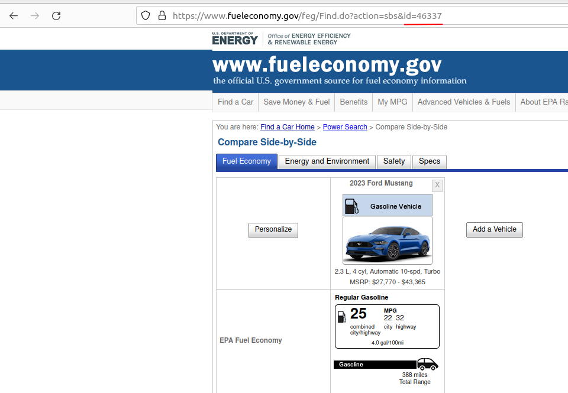

# CarLoanCalculator

## Description

This projects showcases a simple car affordability calculator written in python which compares the monthly ownership cost of two cars. The following factors are considered:

* fuel: local gas price, typical miles driven, fuel economy
* maintenance: 1-5 year expenses, 6-10 year expenses
* loan: down payment, interest rate / credit score, term length

Purpose: The purpose of this project was to practice coding in Python (creating a simple terminal app, reading from a csv, calling a public api with `requests` library.)

Many assumptions were made about the details required to calculate cost. Check out the [design doc](https://docs.google.com/document/d/1utJqFRnQvSuk0oZsS2ZkfwA_Ksngy38YX5G5fBaCU-s/edit?usp=sharing) for more details.

## Get Started

This project uses [poetry](https://python-poetry.org/) to manage dependencies.

```shell
poetry install
```

**Visual Studio Code**

Select the python interpreter (it should be ./.venv/bin/python)

**Terminal**

Activate the environment. Run `poetry shell` while in the root of the repository.

## Usage

The calculator will ask for a few details. To provide details about the car to the calculator, we take advantage of the API provided by https://www.fueleconomy.gov/feg/ws/. Given a vehicle ID, we can obtain information about the make, model and combined highway and city fuel efficiency (or equiavlent for electric vehicle). To find the vehicle ID of a specific vehicle navigate to https://www.fueleconomy.gov/feg/findacar.shtml and search for a specific vehicle. Note the vehicle ID in the url.



### To Run

```shell
poetry run python app.py
```

### Sample Output

```
############################################
Welcome to the Car Affordability Calculator!
############################################

Overview: This calculator allows you to compare the monthly expected costs of
two vehicles. two vehicles. Vehicle data is pulled from FuelEconomy.gov and
maintenance costs are pulled from a local database.

Select a car on https://www.fueleconomy.gov/feg/findacar.shtml and look at the
URL to find the car id.

###################
Vehicle Information
###################

Vehicle 1 information
-----------------------
Enter car ID (default: Nissan Leaf 46973): 46337
Enter price (default: $30000): 35610

Vehicle 2 information
-----------------------
Enter car ID (default: Nissan Leaf 46973): 46212
Enter price (default: $30000): 43990

################
User Information
################

Enter weekly miles (default: 192): 320
Enter gas price per gallon (default: 3.365):  

Credit Score Range
1 .  300-500
2 .  501-600
3 .  601-660
4 .  661-780
5 .  781-850

Enter credit score (1-5): 5

################
Loan Information
################

Enter down payment (default: 0.0): 10000
Enter loan term in months (default: 60): 

##############
Recommendation
##############

Vehicle Details
+---------+--------------+------------------------------+
| Details | FORD Mustang | TESLA Model Y Long Range AWD |
+---------+--------------+------------------------------+
|   MPG   |     25.0     |            122.0             |
|  Price  |   35610.0    |           43990.0            |
+---------+--------------+------------------------------+

User Data
+----------------+---------+
|   User Data    |  Value  |
+----------------+---------+
|  Weekly Miles  |  320.0  |
| Loal Gas Price |  3.365  |
|  Credit Score  | 781-850 |
|  Down Payment  | 10000.0 |
| Interest Rate  |   4.75  |
+----------------+---------+

Monthly Costs
+---------------+--------------+------------------------------+
| Monthly Costs | FORD Mustang | TESLA Model Y Long Range AWD |
+---------------+--------------+------------------------------+
|      Fuel     |    172.29    |             35.3             |
|  Loan Payment |    528.21    |            701.04            |
|  Maintenance  |    12.25     |             7.08             |
+---------------+--------------+------------------------------+

Recommendation: Purchase FORD Mustang for $35610.0

Explanation
-----------
1. Loan payment is lower for FORD Mustang
2. Overall monthly cost is lower for FORD Mustang
```

## Credits

Credit to PragmatiCoders for ispiration for the problem. Check out his YouTube channel: https://www.youtube.com/@PragmatiCoders to learn about Data Engineering.